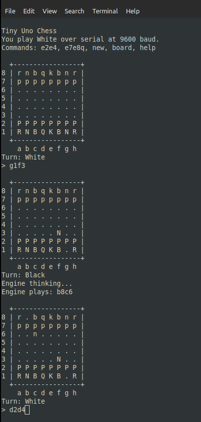

# Tiny Uno Chess - ASM Variant

Small chess game for **Arduino Uno** built with **`avr-gcc`**. This variant is the experimental branch of [Arduino UNO Tiny Chess](https://github.com/UlrikHjort/Arduino-UNO-Tiny-Chess) for moving selected hot paths into AVR assembly while keeping the same serial-playable interface.

## What it does

- Compact board state for AVR RAM limits
- Legal move generation, including castling and en passant
- Promotion input like `e7e8q`
- Shallow built-in engine for the black side
- Plain text board output over serial

The engine is intentionally tiny and memory-first. It uses a simple evaluation plus a shallow negamax search, so it is playable but not strong. 

## Build

```sh
make
```

## Flash

Adjust `PORT` if needed:

```sh
make flash PORT=/dev/ttyACM0
```

## Serial

Open a serial terminal at **9600 baud** and reset the board.

Example session:

```text
e2e4
g1f3
f1c4
```

Commands:

- `help`
- `board`
- `new`

## Notes

- Human plays **White**
- Engine plays **Black**
- Search depth is set in `src/main.c` with `ENGINE_DEPTH`
- Assembly helpers currently live in `src/fast_math.S` and `src/fast_attack.S`


## Screenshot

